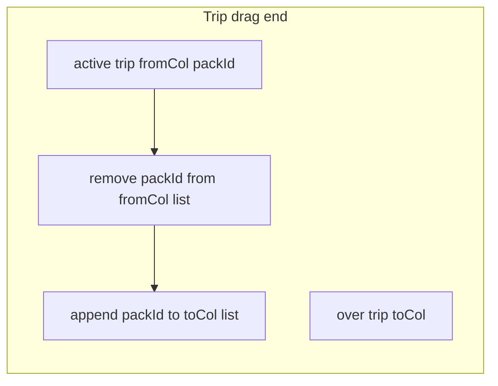

# Trip row — all member zones and multiple packs per zone

## Hard constraint: Day Packs DnD unchanged

The following **must not change** for this task:

- **[`PacksRow`](../src/components/hiking-page/packs-by-users-row.tsx)** — still one day pack per column, [`DroppableColumn`](../src/components/hiking-page/packs-by-users-row.tsx) with **`disabled={!pack}`** (drop only on occupied cells), **swap** of two cells when dragging.
- **Day branch in [`handleDragEnd`](../src/components/hiking-page/packs-by-users.tsx)** — ids without the `trip:` prefix; **swap** logic by `dayNumber` and columns stays as today.
- Types/helpers used **only** for day grouping (`groupProductsByDayAndPack`, `buildBaseAssignments` for days, etc.) are not rewritten for the trip model, except where a shared helper has separate code paths (then the day path stays the same).

All changes below apply **only** to the trip row, `tripAssignments` state, the trip DnD branch, and related helpers (`buildBaseTripAssignments`, etc.).

## Context (current behavior)

- Grid width is already tied to members: `maxPackNumber = hiking.membersTotal` in [`packs-by-users.tsx`](../src/components/hiking-page/packs-by-users.tsx).
- Day and trip rows share the same UX pattern: [`DroppableColumn` / `TripDroppableColumn` with `disabled={!pack}`](../src/components/hiking-page/trip-packs-users-row.tsx) — **drop is only possible on a cell that already has a pack**. With two trip packs and five members, only **two** columns effectively accept drops.
- Trip row state: `tripAssignments: Map<number, string>` — **at most one `packId` per column**; `handleDragEnd` for `trip:` does a **swap** of two cells — incompatible with “several packs in one zone”.
- Backend contract already fits: [`TripPackMemberSlotsPayload`](../src/types/hiking.ts) — `{ packId, memberSlot }[]`; multiple packs may share the same `memberSlot`.

Additionally: current [`buildBaseTripAssignments`](../src/components/hiking-page/hiking-helpers.ts) uses `find(p => p.member_slot === column)` and only places the **first** pack with that slot; others with the same `member_slot` can end up wrong when multiple trip packs belong to one member.

## Target behavior (trip row only)

- For columns `1 … membersTotal`, droppable zones are **always** enabled (including empty columns).
- Each column shows a **stack** of zero or more [`PackCell`](../src/components/hiking-page/packs-by-users-cell.tsx) instances (each with `useDraggable`, id `trip:${column}:${packId}`).
- **Drag end:** move `packId` from source column to target column (remove from source array, append to target array), **no swap**. Drop on the same column — no-op (optional in-column reorder later).
- **Save / dirty:** for each trip pack, current slot = column index where its id appears in the column arrays; compare to server `member_slot`.
- **Column totals** in [`columnTotals`](../src/components/hiking-page/packs-by-users.tsx): sum weights of **all** trip packs in the column.

## File changes

1. **[`hiking-helpers.ts`](../src/components/hiking-page/hiking-helpers.ts)**  
   - Add e.g. `TripColumnAssignments = Map<number, string[]>`.  
   - Rewrite `buildBaseTripAssignments`:  
     - for each `member_slot` in `1..maxPackNumber`, collect **all** `packId`s with that slot into the column array;  
     - remaining packs (no slot or slot out of range) distributed round-robin across `1..maxPackNumber`.  
   - Add helper `findTripPackColumn(assignments, packId)` for payload/dirty logic.

2. **[`packs-by-users.tsx`](../src/components/hiking-page/packs-by-users.tsx)**  
   - Replace `tripAssignments` with `Map<number, string[]>`.  
   - `resolveTripPacks(column): PackInfo[]`.  
   - `handleDragEnd` (`trip:` branch): parse `trip:fromCol:packId` (pack id = segments after column, joined), `over` as `trip:toCol`; move between arrays; **do not change day branch**.  
   - Update `buildTripSavePayload`, `hasTripChanges`, `columnTotals` for arrays.

3. **[`trip-packs-users-row.tsx`](../src/components/hiking-page/trip-packs-users-row.tsx)**  
   - Droppable always enabled for every column.  
   - Accept `resolveTripPacks`; map over `PackInfo[]` per column; empty column shows placeholder **inside** droppable.  
   - Trip row total weight = sum over all columns and all packs.

4. **Tests:** [`hiking-helpers.test.ts`](../src/components/hiking-page/hiking-helpers.test.ts) — `buildBaseTripAssignments` with multiple packs on one `member_slot` and round-robin for unassigned.

## Risks / notes

- **Order within a column:** API stores `memberSlot` only, not order within a zone — UI may show stable order (e.g. by `packId` or array order after DnD) until reload.
- When all packs leave a column it stays empty but remains droppable.

## Flow (trip drag end)

