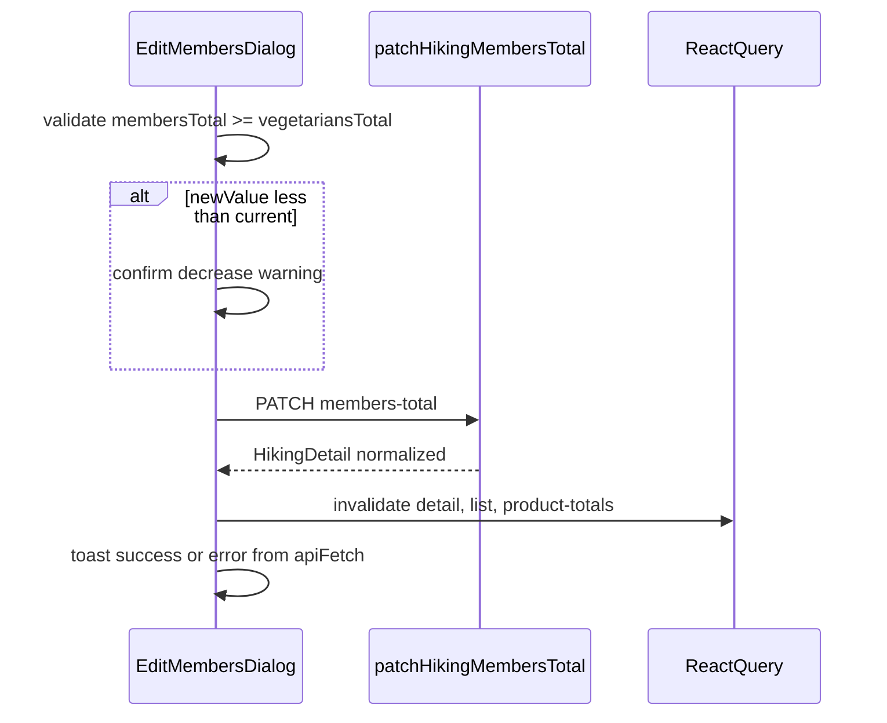

# Change hiking group size (members-total)

## Goal

Allow owners and hiking admins to change `membersTotal` after a hiking plan is created. This is
the **only** supported way to update group size on the backend. Wire the dedicated endpoint
into the React app: API client, React Query hook, and an edit dialog on the hiking Overview
tab with an explicit confirmation when decreasing group size.

`vegetariansTotal` remains editable only at create time (`POST /hikings`) until a future
dedicated endpoint exists — document that limitation in README and business logic docs.

## Backend contract

| Item | Value |
|------|--------|
| Method / path | `PATCH /hikings/{id}/members-total` |
| Request body | `{ "membersTotal": number }` (camelCase) |
| Response | Full hiking row — same shape as `GET /hikings/:id` (`hiking_products`, `day_packs`, `admins`, …) |
| Auth | Owner or hiking admin |
| Validation errors | `400` — e.g. `membersTotal` not a positive integer, or `membersTotal < vegetariansTotal` |

**Server-side behavior (one transaction):**

1. Recomputes every `HikingProduct.total_quantity` as `personal_quantity × membersTotal`
   (overrides manually edited totals).
2. **When decreasing:** deletes `HikingDayPack` rows with `pack_number > newCount` (their meal
   lines become unassigned); clears invalid `member_slot` values (`> newCount`) on day packs
   and trip packs.
3. Stores the new `members_total`.

**When increasing:** only totals are recomputed; no new packs are created — user may need to
re-run auto-distribute per day.



## Current frontend state

- [`hiking-info.tsx`](../src/components/hiking-page/hiking-info.tsx) shows `membersTotal` read-only.
- [`create-hiking-form.tsx`](../src/components/forms/create-hiking-form.tsx) sets `membersTotal` on create.
- [`PacksByUsers`](../src/components/hiking-page/packs-by-users.tsx) and
  [`PacksByDays`](../src/components/hiking-page/packs-by-days.tsx) use `hiking.membersTotal` for column count.
- No `patchHikingMembersTotal` in [`hikings.ts`](../src/api/hikings.ts) yet.

## API and data layer

1. [`src/types/hiking.ts`](../src/types/hiking.ts) — add:

   ```ts
   export type UpdateHikingMembersTotalPayload = { membersTotal: number };
   ```

2. [`src/api/hikings.ts`](../src/api/hikings.ts) — add `patchHikingMembersTotal(hikingId, payload)`:
   - `PATCH /hikings/:id/members-total`
   - Parse response with existing `unwrapHikingDetailResponse` + product/day-pack normalization
     (same as [`postAutoDistributePacks`](../src/api/hikings.ts)).
   - **Refactor (recommended):** extract `normalizeHikingDetailRow(row): HikingDetail` and use in
     `getHiking`, `postAutoDistributePacks`, and the new PATCH to remove duplicated blocks.

3. [`src/schemas/hiking.ts`](../src/schemas/hiking.ts) — factory schema:

   ```ts
   export const createUpdateMembersTotalSchema = (vegetariansTotal: number) =>
     z.object({
       membersTotal: z.number().int().min(1, "At least 1 member"),
     }).superRefine((data, ctx) => {
       if (data.membersTotal < vegetariansTotal) {
         ctx.addIssue({
           code: z.ZodIssueCode.custom,
           message: "Cannot be less than vegetarians count",
           path: ["membersTotal"],
         });
       }
     });
   ```

4. [`src/hooks/use-hikings.ts`](../src/hooks/use-hikings.ts) — add `useUpdateHikingMembersTotal()`:
   - `mutationFn: ({ hikingId, payload }) => patchHikingMembersTotal(hikingId, payload)`
   - On success invalidate:
     - `hikingQueryKeys.detail(hikingId)`
     - `hikingQueryKeys.all` (list cards show people count)
     - `hikingQueryKeys.productTotals(hikingId)`
   - No `setQueryData` (consistent with other hiking mutations).
   - Export from [`src/hooks/index.ts`](../src/hooks/index.ts).

## UI: `EditMembersTotalDialog`

**New file:** `src/components/dialogs/edit-members-total-dialog.tsx`

**Patterns:**

- Form + dialog: [`add-hiking-admin-dialog.tsx`](../src/components/dialogs/add-hiking-admin-dialog.tsx)
- Decrease warning: [`auto-distribute-button.tsx`](../src/components/hiking-page/auto-distribute-button.tsx)
  (`AlertTriangle`, confirm step)

**Props:** `hikingId`, `currentMembersTotal`, `vegetariansTotal`

| Scenario | UX |
|----------|-----|
| Trigger | Small "Change" button next to Members total on Overview |
| Input | `RHFInput` number, `min={Math.max(1, vegetariansTotal)}`, default = current value |
| Hint | Read-only: "Minimum group size: {vegetariansTotal} (vegetarians)" |
| `new === current` | Save disabled |
| `new > current` | PATCH immediately; success toast notes that new member packs are **not** created — use Auto-distribute per day if needed |
| `new < current` | Second step: confirm dialog listing consequences (packs deleted, unassigned meals, slots cleared, totals recalculated) |
| `400` | `apiFetch` toast + inline error in dialog (like Add admin) |
| Success | Close dialog, `toastSuccess` |

**Integration:**

- [`hiking-info.tsx`](../src/components/hiking-page/hiking-info.tsx) — Members total row + dialog
- [`src/components/index.ts`](../src/components/index.ts) — export `EditMembersTotalDialog`

**Permissions:** Show button to all authenticated users (same as other hiking actions); backend
returns `403` for non-owner/non-admin via `apiFetch`.

## Documentation updates (during implementation)

| File | Changes |
|------|---------|
| [`README.md`](../README.md) | Document `patchHikingMembersTotal`, `useUpdateHikingMembersTotal`; note members-total is the only post-create group-size API; **TODO** vegetarians endpoint |
| [`docs/BUSINESS_LOGIC.md`](BUSINESS_LOGIC.md) | Rule: `membersTotal` only via `PATCH .../members-total`; side effects; formula; **Future:** vegetarians edit |
| [`docs/FEATURE_MEMBERS_TOTAL_API_EN.md`](FEATURE_MEMBERS_TOTAL_API_EN.md) | Endpoint reference table + frontend mapping + vegetarians TODO |

## Out of scope

- UI/API to change `vegetariansTotal` after create
- Optimistic `setQueryData` on the hiking detail query
- Frontend owner/admin gating (not used elsewhere on hiking pages)

## Documentation deliverables

Both English-only.

1. **Before implementation** — this file, `docs/members-total-patch-plan.md`.
2. **After implementation** — `docs/members-total-patch-implementation-report.md` with summary,
   file table, API/hook/UI details, doc updates, manual verification checklist.

## Implementation order

| Step | Work |
|------|------|
| 0 | This plan document |
| 1 | Types + `patchHikingMembersTotal` (+ optional `normalizeHikingDetailRow`) |
| 2 | Zod schema + `useUpdateHikingMembersTotal` + hook exports |
| 3 | `EditMembersTotalDialog` + `HikingInfo` + component exports |
| 4 | README + BUSINESS_LOGIC + `FEATURE_MEMBERS_TOTAL_API_EN.md` |
| 5 | Manual testing |
| 6 | Implementation report |

## Manual test checklist

- [ ] Open hiking Overview → Change members → increase: totals refresh, toast mentions auto-distribute
- [ ] Decrease: confirm dialog appears; after confirm, extra day packs gone, Packs tabs column count matches new size
- [ ] Set `membersTotal < vegetariansTotal` → client validation and/or `400` from server
- [ ] Hiking list card shows updated people count after change
- [ ] Shopping list / product totals refetch after change

## Files (planned)

| File | Action |
|------|--------|
| [`src/types/hiking.ts`](../src/types/hiking.ts) | + `UpdateHikingMembersTotalPayload` |
| [`src/api/hikings.ts`](../src/api/hikings.ts) | + `patchHikingMembersTotal`; optional `normalizeHikingDetailRow` refactor |
| [`src/schemas/hiking.ts`](../src/schemas/hiking.ts) | + `createUpdateMembersTotalSchema` |
| [`src/hooks/use-hikings.ts`](../src/hooks/use-hikings.ts) | + `useUpdateHikingMembersTotal` |
| [`src/hooks/index.ts`](../src/hooks/index.ts) | export hook + variables type |
| `src/components/dialogs/edit-members-total-dialog.tsx` | new dialog |
| [`src/components/hiking-page/hiking-info.tsx`](../src/components/hiking-page/hiking-info.tsx) | wire dialog |
| [`src/components/index.ts`](../src/components/index.ts) | export dialog |
| [`README.md`](../README.md) | document API/hook + vegetarians TODO |
| [`docs/BUSINESS_LOGIC.md`](BUSINESS_LOGIC.md) | business rules + future vegetarians |
| [`docs/FEATURE_MEMBERS_TOTAL_API_EN.md`](FEATURE_MEMBERS_TOTAL_API_EN.md) | API reference |
| `docs/members-total-patch-plan.md` | this plan |
| `docs/members-total-patch-implementation-report.md` | report after step 6 |

After code changes: `npm run build` and `npm test` if applicable.
